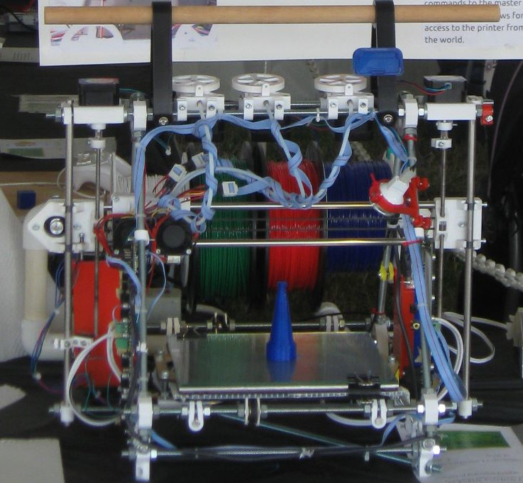

+++
title = "Building a printer"
date = 2014-09-01
+++

I have wanted a 3d printer ever since I saw one in a tech magazine (I don't remember which one). My interests were further developed at Rutger's Day that year. There, they had their Makerbot Cupcake 3d printer. Although it was not operational at the time, I was intrigued. I kept on to the want for about year, constantly nagging my dad the whole time. I was delighted when, about December, he finally decided to buy me one; the deal was that I had to get an A in math, and I did. The printer selection process was long and tedious, but we finally decided in the [RepRapPro Trocolour Mendel](http://reprap.org/wiki/RepRapPro_Tricolour). We chose this printer for many reasons. One of the main things that I liked about it was that it came as a kit. This meant that I had to build it, which was a fun learning experience. Additionally, we thought that the three print heads would come in use one day, although we did not yet know for what. Furthermore, I also liked the idea that the printer can print all the plastic parts for the printer. This makes it easier to make another if we ever wanted to.

The process of building the printer was fun. It took about two weeks during summer break for the initial building, then another couple weeks to get the printer to work. The instructions provided on the RepRapPro website were very clear and easy to follow, making the build process much easier.Once the printer was built, we found the the power supply that was supplied was defective, not outputting the full 12 volts. We emailed RepRapPro, and they were nice enough to send another one. Unfortunately, it had to come all the way from England, and we did not want to wait that long, so we ordered one off Ebay in addition. We now have an extra power supply in case the one that we use ever has a problem, and it has not so far. This delayed the progress of the printer a bit, but I was able to test basic functions from the bench top power supply we have. This did not have enough current to drive any of the heaters, but we were able to move the axis around and test that the electronics worked, as well as basic calibration. I installed [Proterface](https://github.com/kliment/Printrun) and the RepRapPro slicer on my computer, and I was ready. Luckily, there were not problems. Once the power supply arrived, I was ready to hook it up and test the rest of the printer. The heated bed and hot end worked flawlessly, so I was ready for the first print. The first print was one of the vertex frame pieces from the printer, and made an excellent fist print. Surprisingly, the first print came out nearly perfect. I noticed that the extrusion paths on the top finish of the part were squished together a little too much, which meant that I had to calibrate the extrusion flow ratio in the software. Everything worked fine for subsequent prints, until I noticed that the frame was not aligned properly. I went back through the directions, and it turned out that I had missed the step to measure the sides of each of the triangles of the frame. I than had to adjust all the sides, and nearly had to take the printer apart. Luckily, I has able to keep it together.

Once the printer was initially working, I starting making modifications and changes to my print flow. One of the first things I did was to switch to using [Slic3r](http://slic3r.org) rather than the RepRapPro slicer. Originally, Slic3r only had support for one print head, making it unusable with my printer. Luckily, the great people that maintain Slic3r had been working on multiple print heads, and was released quickly. Slic3r proved to be more reliable and had more options to fine tune prints. Other modifications include

