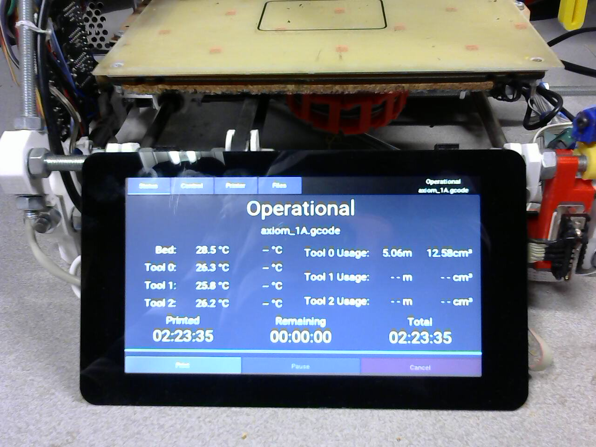

+++
title = "Octoprint"
date = 2014-09-01
+++

After some time of using the printer tethered to my laptop over USB, I decided that there was a better solution. After some web searching, I came across a web server called [Octoprint](http://octoprint.org/). It is designed to run on a small Linux board such as a [Raspberry Pi](https://www.raspberrypi.org/), and provides a nice web interface too your printer. It looked like the exact solution to my problem, so I set it up on a Pi that I had laying around. Once it was set up, it work wonderfully. It has since been running on a raspberry pi on my printer, and is the only way that I connect to it. I have used every model B Pi to run it, from the original Pi B rev 1 with only 256MB RAM to the new Pi 3 with 1.2GHz and 1G RAM. I have closely followed the development of Octoprint, as multiple print head support was originally only available on the development branch.

# Camera

One of the nice feature of Octoprint is the ability to stream a camera feed to the Octoprint interface. This facilitates remote printing and allows long running prints to be monitored. I bought a Raspberry Pi Camera to use, and set up [mjpg-streamer](https://github.com/jacksonliam/mjpg-streamer) to stream the camera. I then set up Octoprint to show the feed, and I was set. The camera has proved to be very useful to monitor long prints, as well as to start prints remotely.

# LCD and Buttons

Although the Octoprint web interface is great for normal printing, it can be annoying to use a laptop to control the printer while controlling the printer manually, such as for calibrating. For this reason, I decided that it would be nice to have a small LCD and some buttons to control the printer through Octoprint. Originally, my plan was to use an ATmega 328 microcontroller to handle the LCD and buttons, which would then communicate to Octoprint on the Pi through a serial connection. I got it somewhat working on the ATmega side, but it was the communication that had issues. I then decided to move to having the Pi control the LCD and buttons directly, hooks up through the Pi's GPIO. This proved to be much more effective than the separate ATmega, and was mostly working for a time. I had a [python script](https://github.com/chickenchuck040/OctoPrint-LcdController) running on the Pi that would communicate to Octoprint over its REST network API, and handle the menus on the LCD. Unfortunately, the REST API was a bit slow for constant use.

# Touchscreen

When the official Raspberry Pi Touchscreen was released, I decided that it would work much better to control the printer than the buttons and LCD that I was using before. After receiving a touchscreen along with the new Raspberry Pi 2, I set to work on an [Octoprint plugin for the touchscreen](https://github.com/chickenchuck040/OctoPrint-Lcd). By using the plugin API instead of the REST network API that I had used before, I would hook directly into Octoprint without having to constantly send it network requests. I used a graphics library called [Kivy](kivy.org) to handle the touchscreen, which made graphics much easier. Furthermore, because Kivy is cross-platform, I was able to run Octoprint with my plugin on my laptop for development. This proved to work much better than the LCD and buttons, and also provided a much nice interface and more features.
